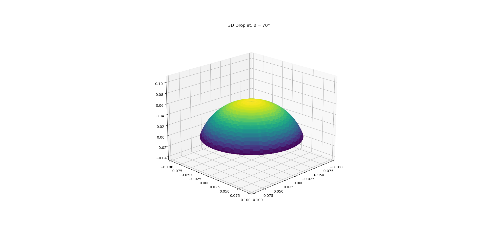
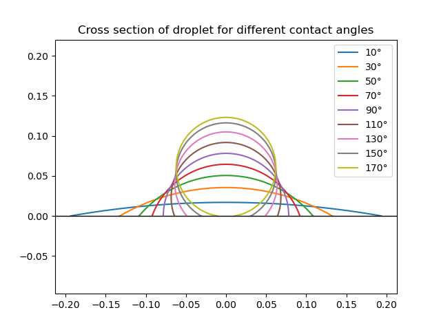
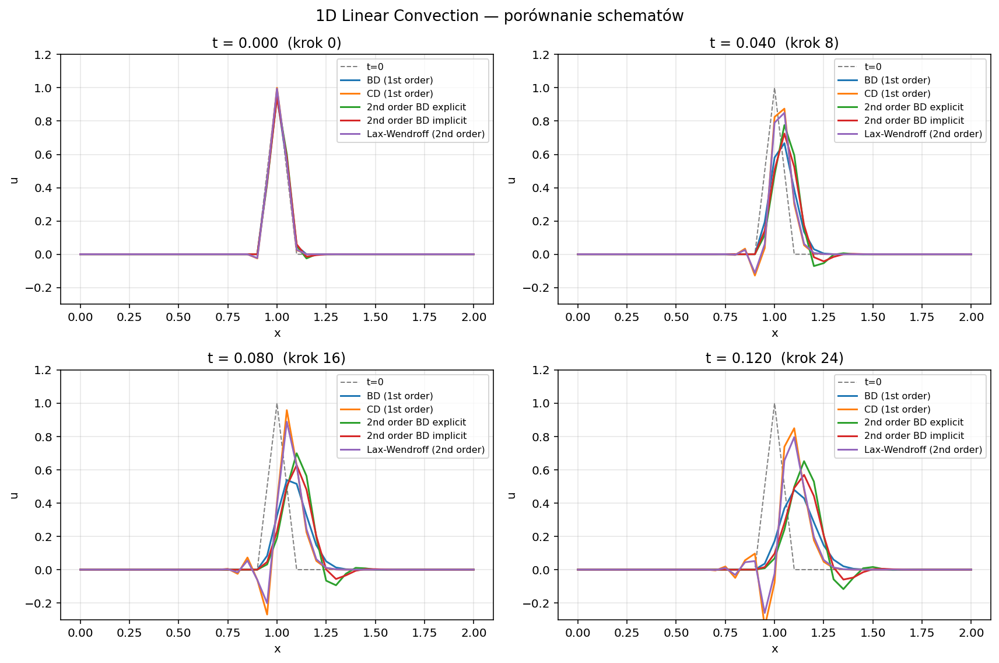
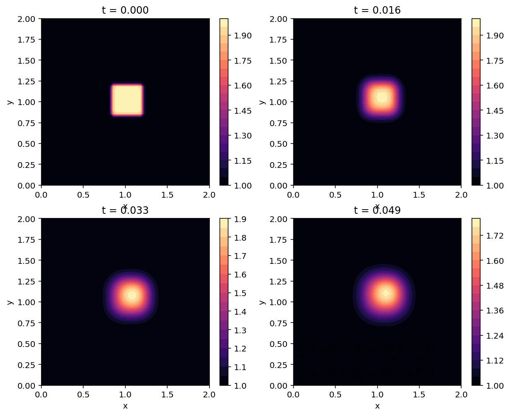
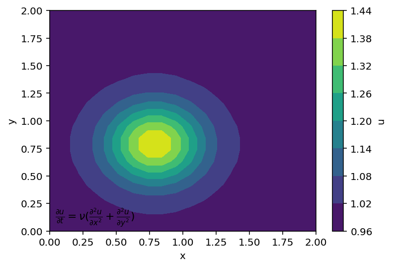
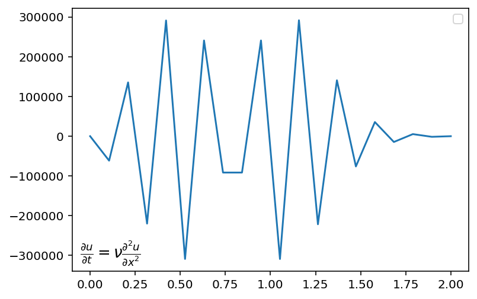

# Computational Fluid Dynamics - From Scratch

First models of droplet.
Implementation of basic CFD equations in 1D and 2D from scratch.

## Models

- Young's Equation for microdroplet
- 1D and 2D Linear Convection
- 1D and 2D Diffusion
- 1D and 2D Nonlinear Convection
- 1D and 2D Burgers' Equation

## Results

## Run

pip install -r requirements.txt
python src/1d-burgers-equation.py
