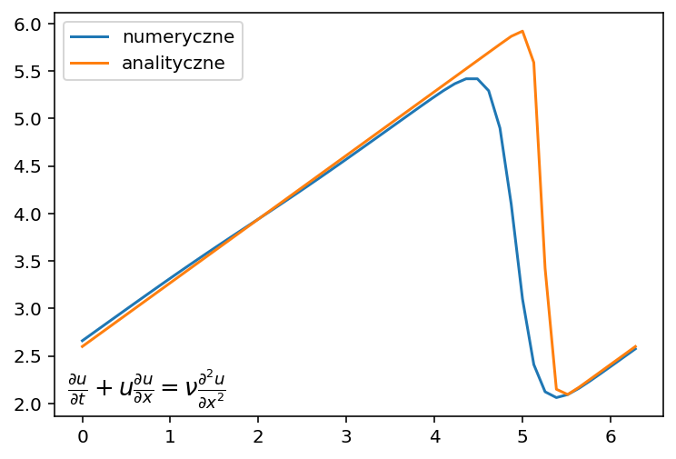

# Computational Fluid Dynamics - From Scratch

Implementation of basic CFD equations in 1D from scratch.

Implementacje równań CFD w 1D napisane od podstaw.

## Models

- Linear Convection
- Nonlinear Convection
- Burgers' Equation

## Results

## Run

pip install -r requirements.txt
python src/1d-burgers-equation.py